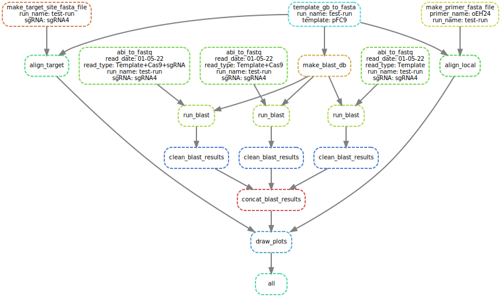
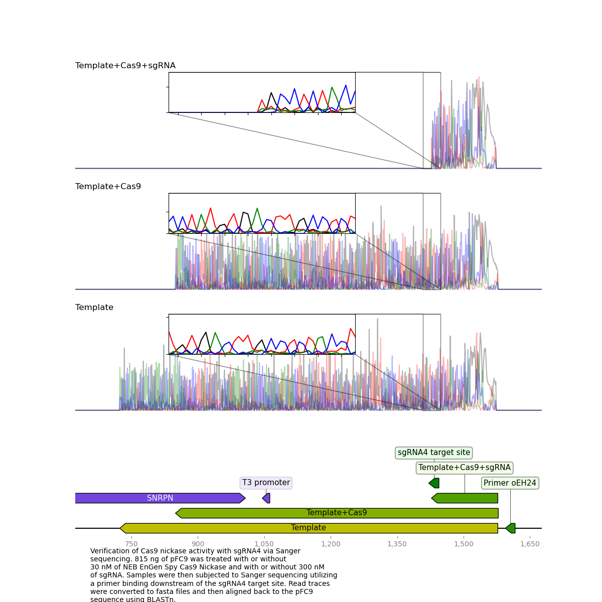

# CaSanger

Cas9 nickase validation by Sanger sequencing analysis workflow: CaSanger.

## Background

CRISPR Cas9 is a RNA guided endonuclease now commonly utilized in a broad range
of molecular biology applications. The native Cas9-sgRNA complex produces DNA
double strand breaks when successfully targeted. Variants of Cas9 have
been engineered with only one active catalytic site; resulting in th enzyme
producing single strand DNA breaks (nicks) when successfully targeted. These
Cas9 "nickases" are commonly used with 2 sets of sgRNAs which together
produce double strand breaks. 

A key component of any Cas9 assay is validation of both the presence and location
of a specific break. There are a variety of methods to validate the presence
of double strand DNA breaks both *in vivo* and *in vitro* but validation of
a nick is more difficult largely due to difficulty of designing a PCR reaction
that will produce target, and nick dependent products.

An alternative approach is to utilize Sanger sequencing which is sensitive 
to DNA perturbations and relies on linear amplification (utilizing a single
primer). If a nicked DNA template is subjected to Sanger sequencing with a
primer that binds to the same strand that is targeted by a nicking
enzyme there should be no distinguishable signal beyond the nick. This
is because if a sufficiently high percentage of the template has the same
targeted nick, the polymerase used in the sequencing reaction will fall off
the single stranded template at the site of nick.

## Running the workflow

### Dependencies

The workflow requires `conda` and `snakemake` to run. See the 
[Snakemake documentation](https://snakemake.readthedocs.io/en/stable/getting_started/installation.html)
for help getting these programs installing on your machine.

### Example workflow

### Configuration files

#### `samples/samples.tsv`

This is the main configuration file you need to worry about. The workflow
uses the parameters and filepaths specified here to function properly. Each
row of this file corresponds to one "validation" experiment, i.e. you
want to show a specific sgRNA successfully targets your nickase to the target
site and cleaves. 

| Field               | Description                                                                            |
|---------------------|----------------------------------------------------------------------------------------|
| sgRNA_fullname      | Long form name of the sgRNA you are validating; must be unique.                        |
| sgRNA_prefered_name | Short form of sgRNA you are validating; must be unique.                                |
| target_PAM          | Target site of sgRNA from 5' -> 3' with the PAM site.                                  |
| cas9-sgRNA-read     | Path to abi (trace file) from read treated with Cas9 and sgRNA.                        |
| cas9-read           | Path to abi (trace file) from read treated with only sgRNA.                            |
| template-read       | Path to abi (trace file) from read with no treatment (template only).                  |
| template_name       | Name of template DNA; must be unique.                                                  |
| template_gb         | Path to genbank file of template DNA sequence.                                         |
| primer_name         | Name of primer used in the sequencing reactions.                                       |
| primer_seq          | Sequence of primer in the 5' -> 3' direction.                                          |
| read_date           | Date of Sanger reactions. (Delim with `-` to avoid possible file path parsing issues). |

## Output

Main output produced are plots showing
read alignments and traces for each sgRNA.
An example plot produced by the workflow is
shown below.

Plots show the Sanger read traces of each 
tested condition and highlight the region
of the trace where the nick is expected to
terminate the read. The bottom most subplot
is a map of the template zoomed in over the
entire region of the longest aligned read. The workflow
will annotate the locations of all read alignments,
the sgRNA target site, and the primer used for sequencing along with any other features already
present in the supplied template genbank file.
Both `png` and `pdf` versions of the plot are produced and will be located in
`output/{run_name}/pots/{sgRNA}/` directory where `{}` indicate variables (snakemake wildcards).
## Known issues

- Currently the plotting script does not taken into account gaps in alignment
  of the Sanger read to the DNA template. This can result in a disparity of a
  few bases when viewing alignments.

